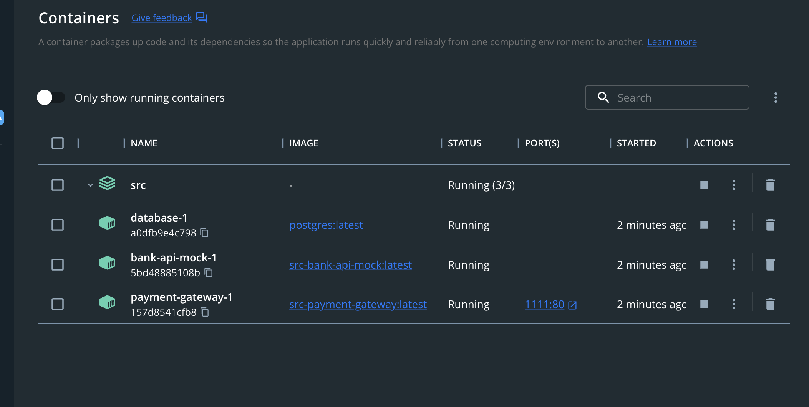
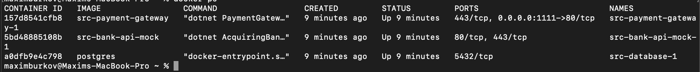

# PaymentGateway

## How to run

To avoid issues with setting up environemt I implemented solutikn with docker compose (You need docker to run solution). To run Payment Gateway using your terminal (on any OS with docker):
- Open terminal
- Change current directory to PaymentGateway/src - `cd FOLDER_WITH_SOLUTION/PaymentGateway/src`
- Run `docker-compose up` command (it could take couple minutes to download and build images and start container). 

This will build and spin up 3 containers: Payment gateway Api, Acquiring bank Api and database.

Docker Desktop example:

`docker ps` example:

- Open http://localhost:1111/swagger/index.html to use Swagger. 
- To avoid any issues with certificates during solution testing I use http that's **only for testing purposes** (we should always use https).

## Architecture

Solution implemented using Clean Architecture (or [Hex. architecture](https://en.wikipedia.org/wiki/Hexagonal_architecture_(software))) approach. PaymentGateway.Core doesn't depend on Api and Infrastructure projects.

Projects:

- PaymentGateway - main api wich is communicate through http with Acquiring bank mock service and stores information about payments in PostgreS database.
- PaymentGateway.Core - this project will contain all code specific to the domain layer.
- PaymentGateway.Infrastructure - this project contains classes for accessing external resources such as web services and database, such as: service for communication with Bank Mock api and database context.

## API description

1. Get /payments returns 

